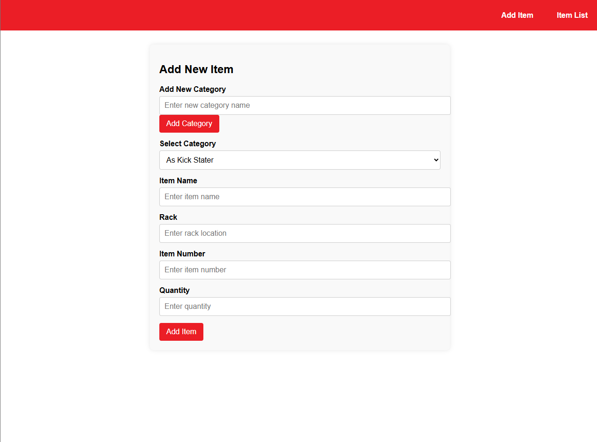
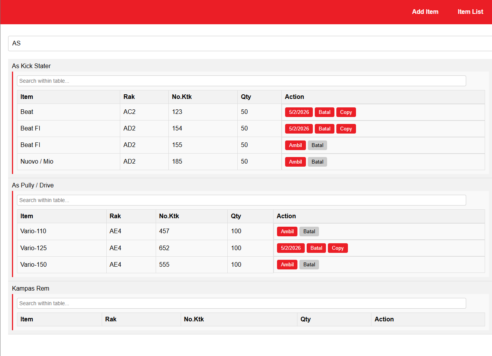

# 📦 Inventory Management Concept (Legacy R&D)

  
  
  
  

## 📝 Overview
This project is a **Proof of Concept (PoC)** developed in early 2024 to explore digital solutions for warehouse operational challenges. It focuses on creating a high-efficiency frontend interface designed to replace manual, paper-based inventory tracking for motorcycle spare parts. 

While this version is a standalone frontend experiment, the UI patterns and data-entry workflows established here served as the **foundational blueprint** for the enterprise-grade ERP Ecosystem currently deployed in production.

---

## 🛠️ Technical Stack & Philosophy
*   **Core:** Semantic HTML5 & Modern CSS3.
*   **Logic:** Vanilla JavaScript for DOM manipulation and interactive state simulation.
*   **UI Philosophy:** A clean, data-centric design following a professional corporate identity, optimized for high-density information display.

---

## 🚀 Key Features

*   **📋 Intuitive Item Registry:** A structured form optimized for rapid data entry, including specific warehouse metadata such as Rack Locations and Box Numbers.
*   **📂 Dynamic Category Management:** Scalable organization logic to categorize thousands of SKUs for accelerated retrieval.
*   **📊 Operational Monitoring:** A clean tabular interface featuring quick-action triggers ("Ambil" and "Batal") to simulate real-time stock movements.
*   **⚡ UX Optimization:** Minimalist layout designed specifically to reduce cognitive load for warehouse staff during high-volume operations.

---

## 📸 Interface Preview

<table border="0">
  <tr>
    <td align="center">
       
      <b>Inventory Registration Form</b>
    </td>
    <td align="center">
       
      <b>Operational Dashboard View</b>
    </td>
  </tr>
</table>

---

## ⚠️ Important Note for Reviewers
> [!NOTE]
> **Research & Development Archive**  
> This repository is strictly for **UI/UX and Frontend architecture review**. These screenshots and code modules demonstrate the proposed data flow and user interaction patterns established during the initial research phase. Persistent data storage and backend integration are not included in this legacy standalone version.
